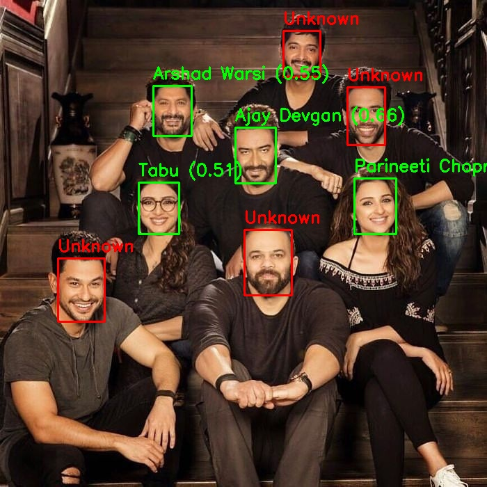

# 🎭 Face Recognition System

A **face recognition system** is a biometric technology that identifies or verifies a person’s identity by analyzing and comparing their facial features against a database of known faces.  

In the real world, it’s used in things like:  
- 🎓 Biometric attendance systems  
- 🚨 Thief/intruder detection in a crowd  
- 🔐 Security checks & access control  
- 📱 IoT devices (smart locks, cameras, etc.)  

---

## 📝 About This Project

This is a **simple face recognition system** built using **InsightFace**.  
Both **face detection** (finding where the face is) and **face recognition** (figuring out *who* it is) are done with **state-of-the-art models** like **ArcFace**.  

Here’s how it works in plain terms:  
- **Face Detection** → Locates faces in an image/video.  
- **Embedding Extraction** → Converts each face into a special numerical vector (called an *embedding*). Think of it as a unique "face fingerprint".  
- **Recognition** → Compares new embeddings with saved ones.  
- **Cosine Similarity** → Measures how close two embeddings are (closer = same person, far = different).  

👉 If the similarity score is above a certain threshold, the system says *who it is*. Otherwise, it marks the face as **Unknown**.  

## 🖼️ Example Output

<table>
  <tr>
    <th>Input Image</th>
    <th>Output Image</th>
  </tr>
  <tr>
    <td>
      
    </td>
    <td>
      
    </td>
  </tr>
</table>


<table>
  <tr>
    <th>Input Video</th>
    <th>Output Video</th>
  </tr>
  <tr>
    <td>
      <video width="300" controls>
        <source src="Videos/example/input.mp4" type="video/mp4">
      </video>
    </td>
    <td>
      <video width="300" controls>
        <source src="Videos/example/output.mp4" type="video/mp4">
      </video>
    </td>
  </tr>
</table>


## 📂 Project Structure

```
project-root/
│
├── src/
│   ├── embedder.py      # register faces (embedding)
│   ├── recogniser.py    # recognize faces
│   ├── main.py          # CLI interface
│   └── face_gui.py      # Gradio GUI
│
├── images/
│   ├── input_images/    # faces you want to register
│   ├── testing_images/  # test images
│   └── output_images/   # results (annotated images)
│
├── videos/
│   ├── testing_video.mp4
│   └── output_video.mp4
│
└── face_embeddings.pickle   # saved embeddings
```
## ⚙️ Setup
Install dependencies:
```
pip install -r requirements.txt
```

## 🧠 How It Works
1. Put face images in images/input_images/
2. Run the embedder to create embeddings
3. Embeddings are stored in face_embeddings.pickle
4. Recognition compares test faces with saved ones
5. If matched → shows name, else → "Unknown"

## ▶️ Usage
**CLI**
```
cd src
python main.py
```
**GUI (Gradio)**
```
cd src
python face_gui.py
```
Opens in your browser.

## 💡 Notes
- Default similarity threshold: 0.4 (can be tuned)
- Works offline after setup
- Can be extended to real-time webcam recognition
- Just a simple project for learning and small demos
